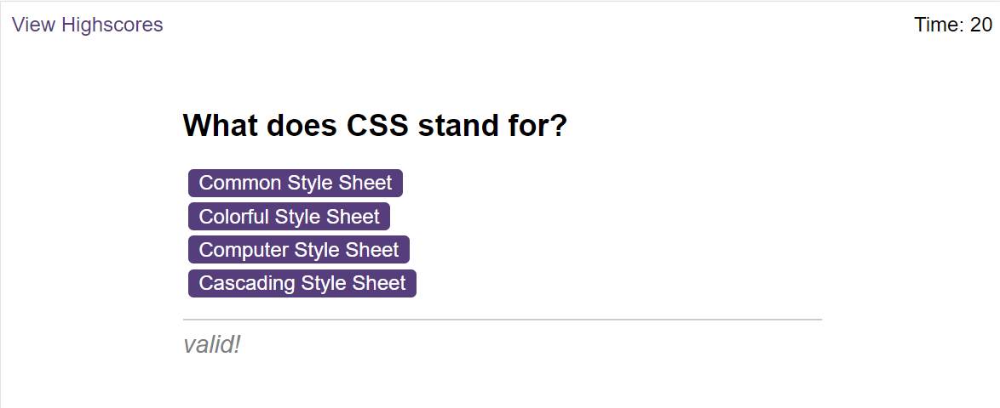

# codeQuiz
Building a timed coding quiz with multiple-choice questions
 
 ## Description
 A timed quiz on JavaScript fundamentals that stores high scores

 ## Technologies used
 - Front-End: HTML, CSS, JavaScript

## Demo png:

  
## git link:
```
https://github.com/Rodiat-Oluwaseun
```
## Deployment:
```
 https://rodiat-oluwaseun.github.io/codeQuiz/
```

## Challenges faced
- Difficulties in understanding the functionalities 

## License
N/A
